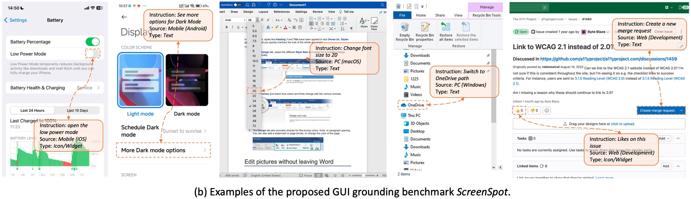
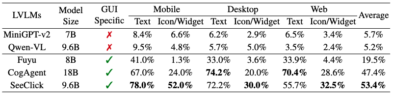

# SeeClick: Harnessing GUI Grounding for Advanced Visual GUI Agents

[](https://arxiv.org/abs/2401.10935) 
[](https://GitHub.com/Naereen/StrapDown.js/graphs/commit-activity) 
[](http://makeapullrequest.com)
[](https://awesome.re)

The model, data, and code for the paper: [SeeClick: Harnessing GUI Grounding for Advanced Visual GUI Agents](https://arxiv.org/abs/2401.10935)

Release Plans:

- [x] GUI grounding benchmark: *ScreenSpot*
- [x] Data for the GUI grounding Pre-training of SeeClick
- [x] Inference code & model checkpoint
- [x] Other code and resources
- [x] Code for pre-training and evaluation on ScreenSpot
- [x] Code for collecting pre-training data

News: SeeClick is accepted by ACL 2024. Other following works [OS-Atlas](https://arxiv.org/abs/2410.23218), [OS-Genesis](https://arxiv.org/abs/2412.19723) are also released !


***
### GUI Grounding Benchmark: *ScreenSpot*

*ScreenSpot* is an evaluation benchmark for GUI grounding, comprising over 1200 instructions from iOS, Android, macOS, Windows and Web environments, along with annotated element types (Text or Icon/Widget). See details and more examples in our paper.

Download the images and annotations of [*ScreenSpot*](https://box.nju.edu.cn/d/5b8892c1901c4dbeb715/) (or download with [Google Drive](https://drive.google.com/drive/folders/1FuFT05yXOV_QxhwYft85YTLOgaIYm_fS?usp=sharing)). 

Each test sample contain: 
* `img_filename`: the interface screenshot file
* `instruction`: human instruction
* `bbox`: the bounding box of the target element corresponding to instruction
* `data_type`: "icon"/"text", indicates the type of the target element
* `data_souce`: interface platform, including iOS, Android, macOS, Windows and Web (Gitlab, Shop, Forum and Tool)



#### Evaluation Results

| LVLMs      | Model Size | GUI Specific | Mobile Text | Mobile Icon/Widget | Desktop Text | Desktop Icon/Widget | Web Text | Web Icon/Widget | Average |
|------------|------------|--------------|-------------|--------------------|--------------|---------------------|----------|-----------------|---------|
| MiniGPT-v2 | 7B         | ❌            | 8.4%        | 6.6%               | 6.2%         | 2.9%                | 6.5%     | 3.4%            | 5.7%    |
| Qwen-VL    | 9.6B       | ❌            | 9.5%        | 4.8%               | 5.7%         | 5.0%                | 3.5%     | 2.4%            | 5.2%    |
| GPT-4V     | -          | ❌            | 22.6%       | 24.5%              | 20.2%        | 11.8%               | 9.2%     | 8.8%            | 16.2%   |
| Fuyu       | 8B         | ✅            | 41.0%       | 1.3%               | 33.0%        | 3.6%                | 33.9%    | 4.4%            | 19.5%   |
| CogAgent   | 18B        | ✅            | 67.0%       | 24.0%              | **74.2%**    | 20.0%               | **70.4%**| 28.6%           | 47.4%   |
| SeeClick       | 9.6B       | ✅            | **78.0%**   | **52.0%**          | 72.2%        | **30.0%**           | 55.7%    | **32.5%**       | **53.4%**|


<!--  -->

***
### GUI Grounding Pre-training Data for SeeClick
Check [data](readme_data.md) for the GUI grounding pre-training datasets,
including the first open source large-scale web GUI grounding corpus collected from Common Crawl.

***
### Inference code & model checkpoint
SeeClick is built on [Qwen-VL](https://github.com/QwenLM/Qwen-VL) and is compatible with its Transformers 🤗 inference code.

All you need is to input a few lines of codes as the examples below.

Before running, set up the environment and install the required packages.
```angular2html
pip install -r requirements.txt
```
> Note: If you want to fine-tune the model, you should follow the [setup](https://github.com/njucckevin/SeeClick/blob/main/agent_tasks/readme_agent.md) and install with requirements_agent.txt.

Then,
```python
import torch
from transformers import AutoModelForCausalLM, AutoTokenizer
from transformers.generation import GenerationConfig

tokenizer = AutoTokenizer.from_pretrained("Qwen/Qwen-VL-Chat", trust_remote_code=True)
model = AutoModelForCausalLM.from_pretrained("SeeClick-ckpt-dir", device_map="cuda", trust_remote_code=True, bf16=True).eval()
model.generation_config = GenerationConfig.from_pretrained("Qwen/Qwen-VL-Chat", trust_remote_code=True)

img_path = "assets/test_img.png"
prompt = "In this UI screenshot, what is the position of the element corresponding to the command \"{}\" (with point)?"
# prompt = "In this UI screenshot, what is the position of the element corresponding to the command \"{}\" (with bbox)?"  # Use this prompt for generating bounding box
ref = "add an event"   # response (0.17,0.06)
ref = "switch to Year"   # response (0.59,0.06)
ref = "search for events"   # response (0.82,0.06)
query = tokenizer.from_list_format([
    {'image': img_path}, # Either a local path or an url
    {'text': prompt.format(ref)},
])
response, history = model.chat(tokenizer, query=query, history=None)
print(response)
```
The SeeClick's checkpoint can be downloaded on [huggingface](https://huggingface.co/cckevinn/SeeClick/tree/main).
Please replace the `SeeClick-ckpt-dir` with the actual checkpoint dir. 

The prediction output represents the point of `(x, y)` or the bounding box of `(left, top, right, down)`,
each value is a [0, 1] decimal number indicating the ratio of the corresponding position to the width or height of the image.
We recommend using point for prediction because SeeClick is mainly trained for predicting click points on GUIs.

***
### Quick smoke test (sample data)

We provide a minimal screenspot sample to verify environment/model wiring.

1) Sample data
- Images: use existing `assets/` (contains `test_img.png`)
- Test JSON: `data/samples/screenspot_test/screenspot_web.json`

2) Run
```bash
python pretrain/screenspot_test.py \
  --qwen_path Qwen/Qwen-VL-Chat \
  --lora_path Qwen-VL-Chat \
  --screenspot_imgs assets \
  --screenspot_test data/samples/screenspot_test \
  --task web
```

Note: bbox in JSON uses `[left, top, width, height]` (pixels); the script normalizes it by image size.

***
### DeepEncoder weights extraction

Use the helper script to extract encoder weights from the full model `deepseek-ai/DeepSeek-OCR`:

```bash
python scripts/extract_deepencoder_weights.py \
  --model deepseek-ai/DeepSeek-OCR \
  --out encoder_weights
```

This will produce:
- `encoder_weights/sam_encoder.pth`
- `encoder_weights/clip_encoder.pth`
- `encoder_weights/projector.pth`

These files are git-ignored by default.

***
## 使用 deepencoder 微调说明（中文）

### 我们做了什么
- 新增视觉塔适配器：`integration/deepencoder_adapter.py`，封装 DeepSeek-OCR 的 SAM + CLIP + Projector，并可替换原 `model.transformer.visual`。
- 扩展微调脚本：`finetune/finetune.py` 新增可选参数（如 `--replace_encoder`、`--deepencoder_path`、`--sam_checkpoint` 等），支持在加载模型后替换视觉编码器。
- 单卡省显存训练脚本：`finetune/finetune_single_gpu.sh`，默认 LoRA + ZeRO-2 + bf16 + gradient checkpointing，适合单张 V100/A100/A40。
- 测试脚本支持替换：`agent_tasks/mind2web_test.py`、`agent_tasks/aitw_test.py`、`agent_tasks/miniwob_test.py` 均新增 `--replace_encoder` 相关参数，方便验证新 encoder。
- 提供权重提取脚本：`scripts/extract_deepencoder_weights.py`，可从 `deepseek-ai/DeepSeek-OCR` 提取 `sam_encoder.pth`、`clip_encoder.pth`、`projector.pth`。
- 提供最小可运行样例：`data/samples/screenspot_test/screenspot_web.json` + `assets/test_img.png`，用于冒烟测试。
- 完善 `.gitignore`：忽略权重、数据、训练产物等大文件。

### 环境准备
1) 创建并激活环境（建议与 `agent_tasks/readme_agent.md` 保持一致）
```bash
conda create -n seeclick-env python=3.8 -y
conda activate seeclick-env
pip install -r requirements_agent.txt
```

2) 可选：如需使用 deepencoder，请准备 DeepSeek-OCR 代码与依赖
- 获取 DeepSeek-OCR 仓库（含 `DeepSeek-OCR-vllm` 目录）
- 安装其需要的依赖（如 `easydict` 等，具体以其官方 README 为准）

### 下载模型与提取 encoder 权重
方式A：从完整模型中提取（推荐）
```bash
python scripts/extract_deepencoder_weights.py \
  --model deepseek-ai/DeepSeek-OCR \
  --out encoder_weights
```
会生成：
- `encoder_weights/sam_encoder.pth`
- `encoder_weights/clip_encoder.pth`
- `encoder_weights/projector.pth`

方式B：直接提供 SAM checkpoint（如官方 SAM ViT-B），CLIP/Projector 走随机初始化或后续加载（不推荐，可能影响效果）。

### 最小冒烟测试（验证环境/推理通路）
```bash
python pretrain/screenspot_test.py \
  --qwen_path Qwen/Qwen-VL-Chat \
  --lora_path Qwen-VL-Chat \
  --screenspot_imgs assets \
  --screenspot_test data/samples/screenspot_test \
  --task web
```
说明：样例 JSON 的 bbox 为像素坐标 `[left, top, width, height]`，脚本会自动按图像尺寸归一化。

### 使用新 encoder 启动单卡省显存微调
脚本：`finetune/finetune_single_gpu.sh`
```bash
DEEPENCODER_PATH=/abs/path/to/DeepSeek-OCR/DeepSeek-OCR-vllm \
SAM_CKPT=/abs/path/to/encoder_weights/sam_encoder.pth \
CLIP_CKPT=/abs/path/to/encoder_weights/clip_encoder.pth \
PROJ_CKPT=/abs/path/to/encoder_weights/projector.pth \
MODEL_PATH=/abs/path/to/SeeClick-pretrain \
QWEN_PATH=Qwen/Qwen-VL-Chat \
DATA_PATH=/abs/path/to/mind2web_train_sft.json \
OUT_DIR=./checkpoint_qwen \
bash finetune/finetune_single_gpu.sh
```
参数说明（部分）：
- `DEEPENCODER_PATH`：指向 deepencoder 代码目录（包含 `deepencoder/sam_vary_sdpa.py` 等文件），用于注入到 `sys.path`。
- `SAM_CKPT`、`CLIP_CKPT`、`PROJ_CKPT`：提取的 encoder 权重（推荐方式A生成）。
- `MODEL_PATH`：SeeClick 预训练基座（或 Qwen-VL 基座）。
- `QWEN_PATH`：原始 Qwen-VL-Chat，用于 tokenizer 与 generation_config。
- `DATA_PATH`：SFT 训练数据路径（如 mind2web 的 SFT json）。
- 默认 LoRA + ZeRO-2 + bf16 + gradient checkpointing，单卡显存更友好。

### 在测试脚本中启用新 encoder（可选）
以 Mind2Web 为例：
```bash
python agent_tasks/mind2web_test.py \
  --model_path /abs/path/to/finetuned-or-lora-checkpoint \
  --qwen_path Qwen/Qwen-VL-Chat \
  --imgs_dir /abs/path/to/mind2web_imgs \
  --task website \
  --replace_encoder \
  --deepencoder_path /abs/path/to/DeepSeek-OCR/DeepSeek-OCR-vllm \
  --sam_checkpoint /abs/path/to/encoder_weights/sam_encoder.pth \
  --clip_checkpoint /abs/path/to/encoder_weights/clip_encoder.pth \
  --projector_checkpoint /abs/path/to/encoder_weights/projector.pth \
  --freeze_sam \
  --freeze_clip
```

### 常见问题（FAQ）
- 显存不够：
  - 降低 `MB_SIZE`，增大 `GA_STEPS`（脚本中默认 4 和 8，可继续调小/调大）。
  - 保持 `--use_lora` 与 `--gradient_checkpointing` 开启。
  - 冻结 SAM（`--freeze_sam True`），必要时也冻结 CLIP（`--freeze_clip True`）。
- 权重 key 不匹配：
  - 使用提取脚本生成的 `sam_encoder.pth / clip_encoder.pth / projector.pth`。
  - 若仍报错，检查 deepencoder 仓库版本与权重来源版本是否一致。
- 维度不一致：
  - `integration/deepencoder_adapter.py` 中 `projector_input_dim/projector_output_dim` 默认 1024，如出现维度不匹配，可按需调整为与你的 Qwen-VL 视觉塔期望一致的维度。


Thanks to [Qwen-VL](https://github.com/QwenLM/Qwen-VL) for their powerful model and wonderful open-sourced work.

***
### Downstream Agent Task
Check [here](agent_tasks/readme_agent.md) to get details of training and testing on three downstream agent tasks,
which also provides a guideline for fine-tuning SeeClick.
```
bash finetune/finetune_lora_ds.sh --save-name SeeClick_test --max-length 704 --micro-batch-size 4 --save-interval 500 
    --train-epochs 10 --nproc-per-node 2 --data-path xxxx/data_sft.json --learning-rate 3e-5 
    --gradient-accumulation-steps 8 --qwen-ckpt xxxx/Qwen-VL-Chat --pretrain-ckpt xxxx/SeeClick-pretrain
    --save-path xxxx/checkpoint_qwen
```
* `data-path`: generated sft data, the format can be found in [here](https://github.com/QwenLM/Qwen-VL#data-preparation)
* `qwen-ckpt`: origin Qwen-VL ckpt path for loading tokenizer
* `pretrain-ckpt`: base model for fine-tuning, e.g. SeeClick-pretrain or Qwen-VL
* `save-path`: directory to save training checkpoints

The fine-tuning scripts are similar to Qwen-VL, except for we use LoRA to fine-tune customized parameters, as in `finetune/finetune.py lines 315-327`.
This scripts fine-tune pre-train LVLM with LoRA and multi-GPU training; for more option like full-finetuning, Q-LoRA and single-GPU training, please
refer to [Qwen-VL](https://github.com/QwenLM/Qwen-VL/tree/master?tab=readme-ov-file#finetuning).

***
### Pre-training and Evaluation on ScreenSpot
You can easily organize the above data yourself for model training and testing on ScreenSpot. 
As an alternative, we provide a set of scripts used for data processing, pre-training, and testing on ScreenSpot.
```
cd pretrain
```
#### Data Processing for Pre-Training
```
python pretrain_process.py --mobile_imgs xxxx/combined --web_imgs xxxx/seeclick_web_imgs 
    --widgetcap_json xxxx/widget_captioning.json --ricosca_json xxxx/ricosca.json 
    --screensum_json xxxx/screen_captioning.json --web_json xxxx/seeclick_web.json 
    --coco_imgs xxxx/coco/train2017 --llava_json xxxx/llava_instruct_150k.jsonl
```
Generate the dataset containing about 1M samples for continual pre-training at `../data/sft_train.json`.

#### GUI Grounding Pre-training
```
cd ..
bash finetune/finetune_lora_ds.sh --save-name seeclick_sft --max-length 768 --micro-batch-size 8 
    --save-interval 4000 --train-epochs 3 --nproc-per-node 8 --data-path ./data/sft_train.json 
    --learning-rate 3e-5 --gradient-accumulation-steps 1 --qwen-ckpt xxxx/Qwen-VL-Chat 
    --pretrain-ckpt xxxx/Qwen-VL-Chat  --save-path xxxx/checkpoint_qwen
```
#### Evaluation on ScreenSpot
```
cd pretrain
python screenspot_test.py --qwen_path xxxx/Qwen-VL-Chat --lora_path xxxx/checkpoint_qwen/seeclick_sft/checkpoint-20000 --screenspot_imgs xxxx/screenspot_imgs --screenspot_test xxxx/ScreenSpot --task all
```
***
### Collecting Pre-training Data from Common Crawl
We used Selenium to crawl web pages from Common Crawl. See details in this [repo](https://github.com/chuyg1005/seeclick-crawler).

***
### Citation
```
@inproceedings{cheng2024seeclick,
    title = "{S}ee{C}lick: Harnessing {GUI} Grounding for Advanced Visual {GUI} Agents",
    author = "Cheng, Kanzhi  and
      Sun, Qiushi  and
      Chu, Yougang  and
      Xu, Fangzhi  and
      YanTao, Li  and
      Zhang, Jianbing  and
      Wu, Zhiyong",
    booktitle = "Proceedings of the 62nd Annual Meeting of the Association for Computational Linguistics (Volume 1: Long Papers)",
    month = aug,
    year = "2024",
    address = "Bangkok, Thailand",
    publisher = "Association for Computational Linguistics",
    url = "https://aclanthology.org/2024.acl-long.505",
    pages = "9313--9332"
}
```

***
### License 
This project incorporates specific datasets and checkpoints governed by their original licenses. Users are required to adhere to all terms of these licenses. No additional restrictions are imposed by this project beyond those specified in the original licenses.
